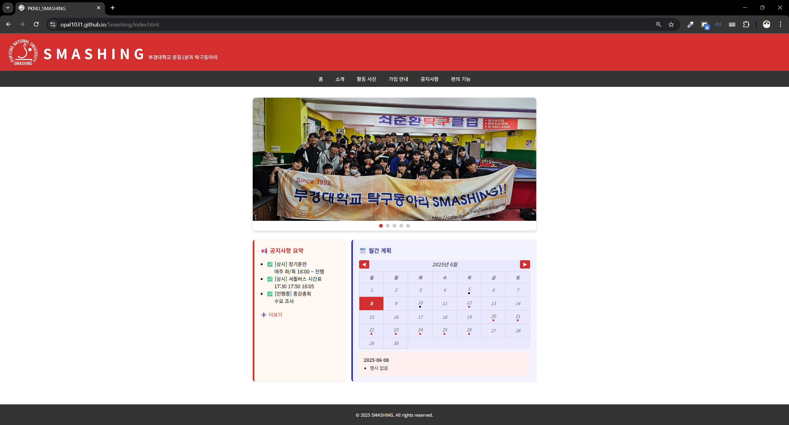

# SMASHING




```
해당 웹페이지는 부경대학교 운동1분과 탁구동아리 '스매싱(Smashing)'의 공식 웹페이지입니다.

이 웹페이지는 부경대학교 재학생 및 부원을 위한 정보 제공을 목적으로 제작되었습니다.
```

<br><br>

# 🔗 Link : [SMASHING 웹페이지 바로가기](https://opal1031.github.io/Smashing/)

<br><br>

# 📘 Intro

### 🌐 웹사이트 구성
|페이지|내용|
|:--:|:--:|
|**홈**|동아리 소개 및 환영 인사|
|**소개**|동아리 활동 개요 및 FAQ|
|**활동 사진**|다양한 행사 및 훈련 사진|
|**가입 안내**|신입 부원 모집 일정 및 신청 안내|
|**공지사항**|최신 정보 제공 및 공지사항 게시판|
|**편의기능**|팀 구성, 대진표 생성 등 다양한 기능 제공|

<br>

# 🛠️ Dev_Log

### 1️⃣ Version_Table
|Version|Date|Description|
|:--:|:--:|:--:|
|v1.0|25.05.23.|프로젝트 구상|
|v1.1|25.05.30.|아이디어 스케치 및 기본 구조 작성|
|v1.2|25.06.06.|GitHub Pages 배포|
||||
|v2.0|25.06.06.|홈 화면 UI 개선 및 README.md 작성|
|v2.1|25.06.06.|공지사항 구조 개선 & 갤러리 콘텐츠 최신화|
|v2.2|25.06.06.|홈 화면 슬라이드 이미지 구현 및 홍보 콘텐츠 추가|
||||
|v3.0|25.06.07.|전체 Source Code 검토 & 추가 편의 기능 기획|
|v3.1|25.06.07.|조 편성 및 대진표 생성 기능 구현|
|v3.2|25.06.08.|홈 화면 캘린더 기능 개선|
||||
|v4.0|25.06.08.|최종 README.md 문서 보완 (페이지별 시각 자료 포함)|

### 2️⃣ Upcoming_Versions
|Version|Planned Features|
|:--:|:--:|
|v4.1|갤러리 콘텐츠 최신화|


### 3️⃣ Tech_Stack
<span>
    
    
    
    
</span><br>
GitHub Pages 기반 배포<br>
- https://opal1031.github.io/Smashing/

### 4️⃣ Project_Structure
```plaintext
📦 Smashing
├── index.html
├── html/
│ ├── intro.html
│ ├── gallery.html
│ ├── join.html
│ ├── notices.html
│ └── conven.html
├── css/
│ ├── style.css
│ ├── main_content.css
│ ├── home.css
│ ├── home_calendar.css
│ ├── gallery.css
│ ├── gallery_modal.css
│ ├── notices.css
│ └── conven.css
├── js/
│ ├── home_slider.js
│ ├── home_calendar.js
│ ├── home_calendar_events.js
│ ├── gallery.js
│ ├── notices.js
│ └── conven.js
└── images/
```